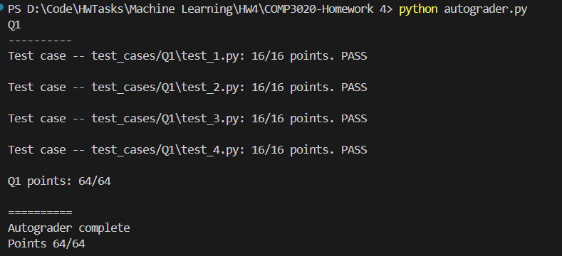

# **Report on the Training Process of the Neural Network**

## **A. Workflow & All Helper functions**

### **1. Weight and Bias Initialization**

The weights (`W1`, `W2`) and biases (`b1`, `b2`) are initialized according to the parameter `init_rand`:

- Random initialization uses a uniform distribution in `[-0.1, 0.1]`.
- Alternatively, weights can be initialized to `0`.

Code snippet:

```py
def initialize_weights(input_size, num_hidden, output_size, init_rand):
    if init_rand:
        W1 = np.random.uniform(-0.1, 0.1, (input_size, num_hidden))
        b1 = np.zeros((1, num_hidden))
        W2 = np.random.uniform(-0.1, 0.1, (num_hidden, output_size))
        b2 = np.zeros((1, output_size))
    else:
        W1 = np.zeros((input_size, num_hidden))
        b1 = np.zeros((1, num_hidden))
        W2 = np.zeros((num_hidden, output_size))
        b2 =np.zeros((1, output_size))
    return W1, b1, W2, b2
```

---

### **2. Forward Pass**

Input features `X` are passed through the hidden and output layers:

- **Hidden Layer**:
  ```py
  z1 = np.dot(x, W1) + b1
  a1 = sigmoid(z1)
  ```
- **Output Layer**:
  ```py
  z2 = np.dot(a1, W2) + b2
  a2 = softmax(z2)
  ```

The `softmax` activation ensures predicted probabilities sum to 1.

---

### **3. Cross-Entropy Loss**

The loss function measures the difference between true labels and predicted probabilities:

```py
def cross_entropy_loss(y, y_hat):
    m = y.shape[0]
    log_likelihood = -np.log(y_hat[range(m), y])
    loss = np.sum(log_likelihood) / m
    return loss
```

---

### **4. Backward Pass**

The gradients of the loss function with respect to the weights and biases are defined in the backward pass:

- **Gradient of the loss with respect to the output layer**:
  ```py
  delta2 = a2
  delta2[0, y] -= 1
  dW2 = np.dot(a1.T, delta2)
  db2 = delta2
  ```
- **Gradient of the loss with respect to the hidden layer**:
  ```py
  delta1 = np.dot(delta2, W2.T) * a1 * (1 - a1)
  dW1 = np.dot(x.T, delta1)
  db1 = delta1
  ```

---

### **5. Weight Updates**

Using SGD, the weights and biases are updated:

```py
def update(a, da, learning_rate):
    return a - learning_rate * da
```

For example:

```py
W1 = update(W1, dW1, learning_rate)
b1 = update(b1, db1, learning_rate)
```

---

### **6. Validation**

After each epoch, the model evaluates:

- **Validate function**:

  ```py
  def validate(y, a2):
    """Compute the loss and accuracy on the validation set."""
    loss = cross_entropy_loss(y, a2)
    err, y_hat = accuracy(y, a2)

    return loss, err, y_hat
  ```

- **Apply to Train and Validation Accuracy**:
  ```py
  # Train
  loss_train, err_train, y_hat_train = validate(y_train, a2_train)
  # Validatation
  loss_val, err_val, y_hat_val = validate(y_val, a2_val)
  ```

---

## **B. Observations**

- **Loss Trends**:
  - Training and validation losses decrease over time when the model trains successfully.
- **Validation Accuracy**:
  - The accuracy stabilizes as the model converges.
- **Overfitting**:
  - Overfitting is monitored by comparing training and validation losses.

---

## **C. Conclusion**

**Test Result:**



**The neural network training process follows the standard SGD workflow:**

1. Forward pass to compute predictions and loss.
2. Backward pass to compute gradients via chain rule.
3. Update weights using the calculated gradients.
4. Evaluate model on train and validation sets at each epoch.
