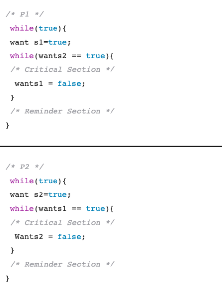
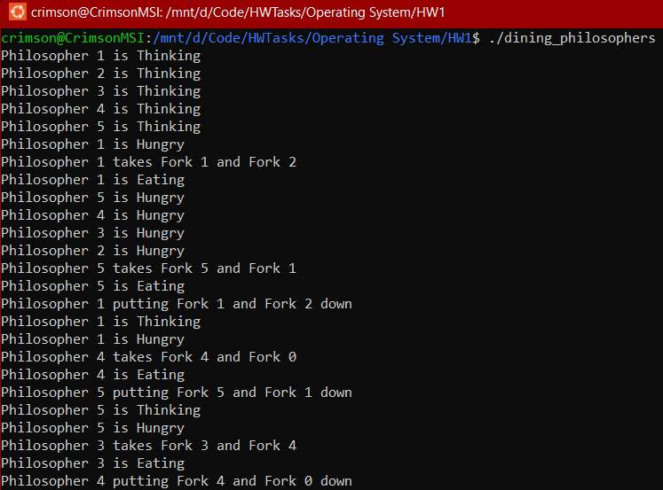
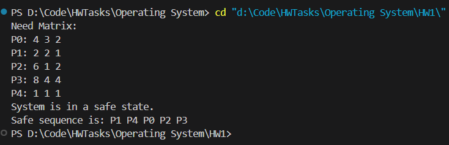

##### V202200664 - Luu Nguyen Chi Duc

# Operating System Homework 01

## Part A - Process Synchronization

### 1. The Critical-Section Problem (CSP)

<div style="text-align: center; margin-top: 20px">
    
</div>

The construct allow mutual exclusion, meaning only one process can enter at a time.
However, if both processes want to enter the critical section simultaneously, they may end up in a deadlock.

Therefore, the answer is **`D. It does not prevent deadlocks, but ensures mutual exclusion.`**

---

### 2. Requirements for Solution to CSP

```c
do {
    while (turn != i) ;
    CS_i;
    turn = j ;
    REMAIN_i;
} while(1);
```

The `turn` control variable alternates between two processes P1 and P2, but it can cause a **bounded waiting violation** if one process keeps it in its favor. This could prevent the other process from accessing the critical section indefinitely, causing starvation.

This happens if `turn` is set to one process's ID, the other process may wait indefinitely, violating bounded waiting.

---

### 3. Dining Philosopher Problem Using Semaphores

**Code `dining_philosophers.c`:**

```c
#include <pthread.h>
#include <semaphore.h>
#include <stdio.h>
#include <unistd.h>

#define NUM_PHILOSOPHERS 5

sem_t forks[NUM_PHILOSOPHERS];

void *philosopher(void *num)
{
    int id = *(int *)num;

    while (1)
    {
        printf("Philosopher %d is Thinking\n", id + 1);
        sleep(1);

        printf("Philosopher %d is Hungry\n", id + 1);

        sem_wait(&forks[id]);

        sem_wait(&forks[(id + 1) % NUM_PHILOSOPHERS]);

        printf("Philosopher %d takes Fork %d and Fork %d\n", id + 1, id + 1, (id + 2) % NUM_PHILOSOPHERS);

        printf("Philosopher %d is Eating\n", id + 1);
        sleep(1);

        sem_post(&forks[id]);
        sem_post(&forks[(id + 1) % NUM_PHILOSOPHERS]);
        printf("Philosopher %d putting Fork %d and Fork %d down\n", id + 1, id + 1, (id + 2) % NUM_PHILOSOPHERS);
    }
}

int main()
{
    pthread_t philosophers[NUM_PHILOSOPHERS];
    int ids[NUM_PHILOSOPHERS];

    for (int i = 0; i < NUM_PHILOSOPHERS; i++)
    {
        sem_init(&forks[i], 0, 1);
        ids[i] = i;
    }

    for (int i = 0; i < NUM_PHILOSOPHERS; i++)
        pthread_create(&philosophers[i], NULL, philosopher, &ids[i]);

    for (int i = 0; i < NUM_PHILOSOPHERS; i++)
        pthread_join(philosophers[i], NULL);

    for (int i = 0; i < NUM_PHILOSOPHERS; i++)
        sem_destroy(&forks[i]);

    return 0;
}
```

**Teminal Output:**

<div style="text-align: center; margin-top: 20px">
    
</div>

---

## Part B - Deadlocks

### Question 1

_Provide a real-world example of deadlocks_

An example of a deadlock is two people using a shared printer and scanner:

- Person A is using the printer and waiting for the scanner.
- Person B is using the scanner and waiting for the printer.

Each person holds one resource (printer or scanner) and waits for the other resource, causing a deadlock.

This situation meets all four conditions for deadlock:

- **Mutual Exclusion**: Only one person can use the printer or scanner at a time.
- **Hold and Wait**: Each person holds one device and waits for the other.
- **No Preemption**: Neither person is allowed to take away the resource forcefully from another
- **Circular Wait**: Person A waits for the scanner (held by Person B), and Person B waits for the printer (held by Person A), thus creating a cycle.

_Does a cyclic dependency always lead to deadlock? Why or why not?_

No, a cyclic dependency does not always lead to deadlock.
Actual deadlock will occur only if all four conditions are satisfied:

    1. Mutual exclusion
    2. Hold and Wait
    3. No Preemption
    4. Circular Wait

For example: The system has multiple instances of each resource, a cyclic dependency may exist without causing a deadlock, as some processes could still proceed.

### Question 2

In the Dining Philosophers Problem, deadlock can occur when each philosopher picks up the left chopstick and waits for the right chopstick.

- **Mutual Exclusion**: Each chopstick is a shared resource that only one philosopher can use at a time. Only one philosopher can hold a chopstick, satisfying the mutual exclusion condition.

- **Hold and Wait**: Once a philosopher picks up one chopstick, they hold it while waiting for the other chopstick. Each philosopher holds onto one chopstick while waiting for the other, meeting the hold and wait condition.

- **No Preemption**: chopsticks cannot be forcibly taken from a philosopher. A philosopher can only release a chopstick voluntarily after eating, meeting the no preemption condition.

- **Circular Wait**: A circular wait occurs when every philosopher picks up his left chopstick and then waits for the right chopstick. As an example, in such a case, Philosopher 0 is waiting for Philosopher 1's chopstick, Philosopher 1 is waiting for Philosopher 2's chopstick and so forth until Philosopher n−1 is waiting for Philosopher 0's chopstick. A cycle is formed that fulfills the condition of circular wait.

Since all four conditions are satisfied, deadlock can occur if each philosopher tries to pick up the left chopstick first.

### Question 3

**Code `banker_algo`:**

```c
#include <stdio.h>
#include <stdbool.h>

#define NUM_PROCESSES 5
#define NUM_RESOURCES 3

void calculateNeed(int need[NUM_PROCESSES][NUM_RESOURCES], int max[NUM_PROCESSES][NUM_RESOURCES], int allocation[NUM_PROCESSES][NUM_RESOURCES])
{
    for (int i = 0; i < NUM_PROCESSES; i++)
        for (int j = 0; j < NUM_RESOURCES; j++)
            need[i][j] = max[i][j] - allocation[i][j];
}

void printNeedMatrix(int need[NUM_PROCESSES][NUM_RESOURCES])
{
    for (int i = 0; i < NUM_PROCESSES; i++)
    {
        printf("P%d: ", i);
        for (int j = 0; j < NUM_RESOURCES; j++)
            printf("%d ", need[i][j]);
        printf("\n");
    }
}

bool isSafe(int available[NUM_RESOURCES], int max[NUM_PROCESSES][NUM_RESOURCES], int allocation[NUM_PROCESSES][NUM_RESOURCES])
{
    int need[NUM_PROCESSES][NUM_RESOURCES];
    calculateNeed(need, max, allocation);

    bool finish[NUM_PROCESSES] = {0};
    int safeSequence[NUM_PROCESSES];
    int work[NUM_RESOURCES];

    for (int i = 0; i < NUM_RESOURCES; i++)
        work[i] = available[i];

    int count = 0;
    while (count < NUM_PROCESSES)
    {
        bool found = false;
        for (int p = 0; p < NUM_PROCESSES; p++)
        {
            if (!finish[p])
            {
                int j;
                for (j = 0; j < NUM_RESOURCES; j++)
                    if (need[p][j] > work[j])
                        break;

                if (j == NUM_RESOURCES)
                {
                    for (int k = 0; k < NUM_RESOURCES; k++)
                        work[k] += allocation[p][k];
                    safeSequence[count++] = p;
                    finish[p] = true;
                    found = true;
                }
            }
        }

        if (!found)
        {
            printf("System is not in a safe state.\n");
            return false;
        }
    }

    printf("System is in a safe state.\nSafe sequence is: ");
    for (int i = 0; i < NUM_PROCESSES; i++)
        printf("P%d ", safeSequence[i]);

    printf("\n");

    return true;
}

int main()
{
    int allocation[NUM_PROCESSES][NUM_RESOURCES] = {
        {1, 1, 2},
        {2, 1, 2},
        {3, 0, 1},
        {0, 2, 0},
        {1, 1, 2}};

    int max[NUM_PROCESSES][NUM_RESOURCES] = {
        {5, 4, 4},
        {4, 3, 3},
        {9, 1, 3},
        {8, 6, 4},
        {2, 2, 3}};

    int available[NUM_RESOURCES] = {3, 2, 1};

    int need[NUM_PROCESSES][NUM_RESOURCES];
    calculateNeed(need, max, allocation);
    printf("Need Matrix:\n");
    printNeedMatrix(need);

    isSafe(available, max, allocation);

    return 0;
}
```

**Teminal Output:**

<div style="text-align: center; margin-top: 20px">
    
</div>
