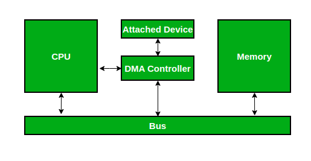
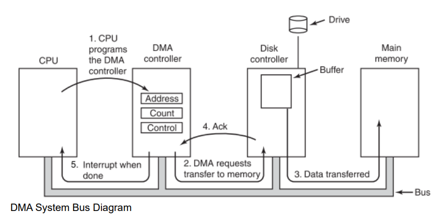

##### V202200664 - Luu Nguyen Chi Duc

# Operating System HW3

## Problem 1 – I/O Devices

1. **Port**:

   A **port** is a connection point through which a device communicates with the computer. It acts as the interface connecting the system to the external hardware.

2. **Bus**:

   A **bus** is a collection of wires or a pathway in the system that enables the exchange of data, addresses, and control signals between different entities like the CPU, memory, and peripheral devices. It follows a specific protocol for communication.

3. **Controller**:

   A **controller** is a set of electronics responsible for managing a specific port, bus, or device. It interprets commands and facilitates communication between the CPU and the hardware.

4. **Device Driver**:

   A **device driver** is software that translates high-level commands from the operating system into low-level instructions understandable by a device controller.

## Problem 2 – CPU Communication

### 1. **System Bus**

**Why is it important to scale up system-bus and device speeds as CPU speed increases?**

- The system bus serves as the communication backbone between the CPU, memory, and I/O devices.
- As the CPU speeds increase, it requires faster buses to avoid data transfer bottlenecks. If this were to scale, the overall performance of the system would worsen since the CPU would wait longer for the slower parts.
- Example: High-speed buses like PCIe and NVMe allow faster data exchange, supporting modern CPU speeds.

### 2. **Memory-Mapped I/O**

**What are the advantages and disadvantages of supporting memory-mapped I/O to device-control registers?**

- **Advantages**:

  1. Simplification: Treating device registers as memory locations simplifies communication, thus reducing the need for special I/O instructions.
  2. Uniform address space: CPU can use the same instruction set for accessing memory and I/O.
  3. Faster execution: Memory access can be optimized via caching and other memory-level optimizations.

- **Disadvantages**:
  1. Loss of cache coherence: Mapping I/O into memory can cause caching issues for frequently changing device registers.
  2. Address space usage: Consumes physical memory address space, reducing available memory for programs.

### 3. **Interrupt Handling**

**Considerations for assigning interrupt priorities**:

1. **Criticality**: Devices critical to system stability such as power supply sensors, should have the highest priority.
2. **Timing requirements**: The priorities for devices that require low latency, such as network cards, should also be higher.
3. **Frequency**: Lower priority is granted to those devices whose interrupts happen frequently to avoid flooding interrupts, like keyboards.
4. **Nonmaskable vs. Maskable**: Assign nonmaskable interrupts to events that cannot be delayed, like system alarms.

---

## Problem 3 – Direct Memory Access (DMA)

### 1. **What is DMA?**

- **Definition**:
  Direct Memory Access (DMA) is the ability of the computer system that enables the I/O device to transfer data from or to main memory directly without involving CPU in every byte of the transfer.

- **How it helps improve file system performance**:
  1. **Reduces CPU workload**: Instead of the CPU handling every byte, the DMA controller manages the entire data transfer.
  2. **Efficient large data transfers**: DMA enables bulk data movement, such as loading a file from a disk, without interrupting the CPU for every step.
  3. **Minimizes latency**: By offloading work from the CPU, DMA can reduce delays in handling other tasks, improving overall system efficiency.

### 2. **Role of the DMA Controller**

When the DMA is used for a task like disk reads, the DMA controller facilitates direct data transfer between an I/O device (e.g., a disk) and main memory, minimizing CPU involvement. Here is its workflow:

1. **Initialization**:

   The CPU configures the DMA controller by providing:

   - The memory address where data needs to be stored.
   - The count of data bytes to be transferred.
   - The control signals, for example, read or write operation.

2. **Data Request**:

   Once initialized, the DMA controller sends a request to the I/O device via the disk controller in this case to start the transfer.

3. **Direct Data Transfer**:

   The I/O device transfers data directly to or from main memory through the system bus without the intervention of the CPU. This transfer is controlled by the DMA controller.

4. **Acknowledgment**:

   When the transfer of data is over, the DMA controller sends an acknowledgment signal to the CPU, indicating that the operation is over.

5. **Interrupt**:

   The DMA controller sends an interrupt to the CPU, signaling that the transfer is complete, and hence, the CPU can process the data or continue with other tasks.

#### **Key Benefits**:

- Relieves the CPU from data transfer duties, thus allowing it to concentrate on processing other tasks.
- Decreases the number of interrupts required for large transfers.
- Enhances the efficiency of the entire system by minimizing the involvement of the CPU.
