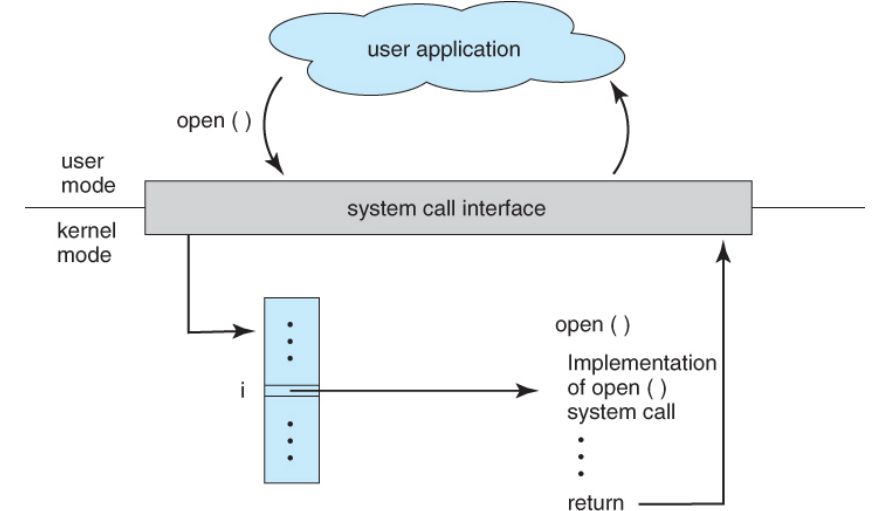
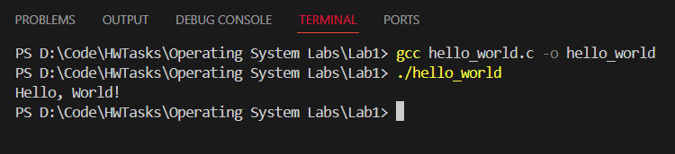

##### V202200664 - Luu Nguyen Chi Duc

# Operating System Lab 01

## Part A - Theory Questions

### 1. What is a System Call, and it is required for which kind of programs?

A **system call** is a method for programs to request services from the kernel of the operating system. It provides an interface that allows user programs to interact with low-level system functions such as file operations, memory management, and process control.

System calls are required for programs that need access to system resources, such as files, devices, or network interfaces.

---

### 2. Computers can store files/data on the disk (Primary storage) for long-term storage purposes. Is that correct?

No, it is not correct to refer to the disk as primary storage.

**Disks** are considered secondary storage, used for long-term data retention. Primary storage typically refers to RAM (Random Access Memory), which is volatile and used for temporary storage while programs are running.

---

### 3. What is the key role of Protection, and why do all OS need Protection?

**Protection** is a system that controls access to system resources, ensuring that only authorized programs, processes, and users can only access those resources. It prevents unauthorized access to critical system components such as files, memory, and hardware.

All OS need protection to maintain security, prevent system crashes, and ensure that multiple users or processes can safely share resources without interfering with each other.

---

### 4. How does the `read()` function work in Unix/Linux systems?

The `read()` system call is used to read data from a file descriptor into a buffer.

The function returns the number of bytes successfully read or -1 in case of an error.

```c
ssize_t read(int fd, void *buf, size_t count);
```

**Parameters:**

- **`fd`:** The file descriptor from which to read. This file descriptor is typically obtained using the `open()` system call.
- **`buf`:** A pointer to the buffer where the read data will be stored.
- **`count`:** The number of bytes to read from the file.

---

<div style="text-align: center; margin-top: 40px">
    
</div>

### 5. Given the figure above. What is the service the figure illustrates and how is it called and processed?

The figure illustrates the **open()** system call, which allows a user application to open a file. The process involves the following steps:

- **User Mode:** A user application, running in user mode triggers the **open()** system call to ask for a file to be opened.

- **System Call Interface:** The system call is passed from the user mode to the **system call interface**. This interface acts as a bridge between user applications and the kernel, allowing user programs to interact with low-level system functions safely.

- **Kernel Mode:** In kernel mode, the OS handles the **open()** request. This involves checking the file's existence, verifying permissions, and opening the file if everything is in order. If successful, it returns a file descriptor (denoted by "i" in the figure).

- **Return to User Mode:** The system call interface returns the result (either a file descriptor or an error code) back to the user application in user mode. The file descriptor is used in subsequent operations such as reading or writing to the file.

---

## Part B - Programming Questions

### Task 1: Compiling and Running a Basic C Program

**Code `hello_world.c`:**

```c
#include <stdio.h>

int main() {
    printf("Hello, World!\n");
    return 0;
}
```

**Output:**

<div style="text-align: center; margin-top: 20px">
    
</div>

---

### Task 2: Compiling and Running a C Program with Functions in Header Files

**Header File `math_operations.h`:**

```c
#ifndef MATH_OPERATIONS_H
#define MATH_OPERITIONS_H

int add(int a, int b);
int subtract(int a, int b);
int multiply(int a, int b);
float divide(int a, int b);

#endif
```

**Source File `main.c`:**

```c
#include <stdio.h>
#include "math_operations.h"

int add(int a, int b) {
    return a + b;
}

int subtract(int a, int b) {
    return a - b;
}

int multiply(int a, int b) {
    return a * b;
}

float divide(int a, int b) {
    if (b == 0) {
        printf("Error: Division by zero!\n");
        return 0;
    }
    return (float)a / b;
}

int main() {
    int num1 = 10, num2 = 5;

    printf("Addition: %d + %d = %d\n", num1, num2, add(num1, num2));
    printf("Subtraction: %d - %d = %d\n", num1, num2, subtract(num1, num2));
    printf("Multiplication: %d * %d = %d\n", num1, num2, multiply(num1, num2));
    printf("Division: %d / %d = %.2f\n", num1, num2, divide(num1, num2));

    return 0;
}
```

**Output:**

<div style="text-align: center; margin-top: 20px">
    
</div>

---

### Task 3: Implementing Basic File Operations Using System Calls

**Code: `file_manipulation.c`:**

```c
#include <fcntl.h>
#include <unistd.h>
#include <stdio.h>
#include <stdlib.h>

int main()
{
    int fd;
    char *buffer;
    int buffer_size = 69;
    ssize_t bytes_read;

    buffer = (char *)malloc(buffer_size * sizeof(char));
    if (buffer == NULL)
    {
        printf("Memory allocation failed!\n");
        return 1;
    }

    fd = open("testfile.txt", O_CREAT | O_WRONLY, 0755);
    if (fd == -1)
    {
        printf("Error opening file!\n");
        return 1;
    }
    write(fd, "Hello, Kieu Hai Dang is the best TA!\n\n\nPlease give me good grades.\n", 69);
    close(fd);

    fd = open("testfile.txt", O_RDONLY);
    if (fd == -1)
    {
        printf("Error opening file!\n");
        return 1;
    }
    while ((bytes_read = read(fd, buffer, buffer_size - 1)) > 0)
    {
        buffer[bytes_read] = '\0';
        printf("%s", buffer);
    }

    close(fd);

    free(buffer);

    return 0;
}
```

**Teminal Output:**

<div style="text-align: center; margin-top: 20px">
    
</div>

---

### Task 4: File Size Determiner

**Code `file_size_determiner.c`:**

```c
#include <stdio.h>
#include <sys/stat.h>

void determineFileSize(const char *filename)
{
    struct stat fileStat;
    if (stat(filename, &fileStat) == 0)
    {
        printf("File size: %ld bytes\n", fileStat.st_size);
    }
    else
    {
        printf("Could not determine file size\n");
    }
}

int main(int argc, char *argv[])
{
    if (argc != 2)
    {
        printf("Usage: %s <filename>\n", argv[0]);
        return 1;
    }

    determineFileSize(argv[1]);
    return 0;
}

```

**Teminal Output:**

<div style="text-align: center; margin-top: 20px">
    
</div>

---

### Task 5: Checking File Permissions in C

**Code `file_permission_checker.c`:**

```c
#include <stdio.h>
#include <sys/stat.h>

void checkPermissions(const char *filename)
{
    struct stat fileStat;
    if (stat(filename, &fileStat) == 0)
    {
        printf("Permissions: %o\n", fileStat.st_mode & 0777);
    }
    else
    {
        printf("Could not check permissions\n");
    }
}

int main(int argc, char *argv[])
{
    if (argc != 2)
    {
        printf("Usage: %s <filename>\n", argv[0]);
        return 1;
    }

    checkPermissions(argv[1]);
    return 0;
}

```

**Teminal Output:**

<div style="text-align: center; margin-top: 20px">
    
</div>

---

## Part C - Bonus Questions

### Question 1: Consider a valid double pointer `char** dbl_char` in a 32-bit system. What is `sizeof(*dbl_char)`?

In a 32-bit system, all pointers (regardless of what they point to) take up 4 bytes of memory.

- `char** dbl_char` is a pointer to a pointer to a `char`.
- The expression `*dbl_char` dereferences the first pointer, so `*dbl_char` is a pointer to a char (`char*`).
- Since pointers are 4 bytes in a 32-bit system, the size of `*dbl_char` (which is a `char*`) is 4 bytes.

---

### Question 2: Are char\* a and char b[] different?

```c
char* a = "162 is the best";
char b[] = "162 is the best";
```

`char* a`: Points to a string literal stored in read-only memory, and the string cannot be modified.

`char b[]`: Is a modifiable character array holding a copy of the string in writable memory.
