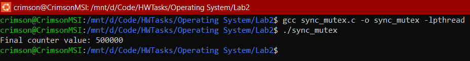

##### V202200664 - Luu Nguyen Chi Duc

# Operating System Lab 02

## Part A - Theory Questions

### 1. In simple terms, what is a process? When a parent process calls `fork()` to create a child process, how does the parent process know the process ID of the created child process?

A **process** is defined as a **program in execution** that progresses in a **sequential manner**.

When a parent process calls `fork()`:

- The parent process receives the process ID (PID) of the child as a return value greater than zero, allowing the parent to identify the child process.
- The child process receives a return value of 0, indicating that it is the newly created process.

---

### 2. What are the benefits of using multiple processes to perform a task instead of multiple threads?

**Fault Isolation**: Processes run in separate memory spaces, meaning if one crashes, others remain unaffected, unlike threads that share the same memory.

**CPU Utilization**: Processes can also utilize multiple CPUs or cores more efficiently in certain scenarios, leading to better performance for CPU-bound tasks.

---

## Part B - Programming Questions

### Task 1: Create a process

**Code `create_process.c`:**

```c
#include <stdio.h>
#include <stdlib.h>
#include <unistd.h>
#include <sys/wait.h>
int main()
{
    pid_t pid = fork();
    if (pid < 0)
    {
        perror("fork");
        exit(1);
    }
    else if (pid == 0)
    {
        printf("Child process with PID: %d\n", getpid());
        sleep(2);
        exit(0);
    }
    else
    {
        printf("Parent process waiting for child to finish...\n");
        wait(NULL);
        printf("Child has finished. Parent process continuing...\n");
    }
    return 0;
}
```

**Output:**

<div style="text-align: center; margin-top: 20px">
    
</div>

---

### Task 2: Generate multiple child processes from parent

**Code `multiple_processes.c`:**

```c
#include <stdio.h>
#include <stdlib.h>
#include <unistd.h>
#include <sys/wait.h>

int main()
{
    int num_children = 5;
    pid_t pid;

    printf("Parent process with PID: %d\n", getpid());

    for (int i = 0; i < num_children; i++)
    {
        pid = fork();
        if (pid < 0)
        {
            perror("fork");
            exit(1);
        }
        else if (pid == 0)
        {
            printf("Child process %d, PID: %d\n", i + 1, getpid());
            exit(0);
        }
        else
        {
            printf("Parent created child %d, PID: %d\n", i + 1, pid);
        }
    }

    for (int i = 0; i < num_children; i++)
    {
        wait(NULL);
    }

    printf("Parent process complete\n");
    return 0;
}
```

**Output:**

<div style="text-align: center; margin-top: 20px">
    
</div>

---

### Task 3: Demonstrate Process Termination in C

**Code `multiple_processes.c`:**

```c
#include <stdio.h>
#include <stdlib.h>
#include <unistd.h>
#include <signal.h>
#include <sys/wait.h>

int main()
{
    pid_t pid;
    int status;

    pid = fork();

    if (pid < 0)
    {
        perror("fork failed");
        exit(1);
    }
    else if (pid == 0)
    {
        printf("Child process PID: %d\n", getpid());
        while (1)
        {
        }
    }
    else
    {
        printf("Parent process PID: %d. Waiting for a few seconds before terminating child with kill()...\n", getpid());
        sleep(3);

        kill(pid, SIGTERM);

        wait(&status);
        if (WIFEXITED(status))
        {
            printf("Child terminated normally with exit status: %d\n", WEXITSTATUS(status));
        }
        else if (WIFSIGNALED(status))
        {
            printf("Child was terminated by a signal: %d\n", WTERMSIG(status));
        }

        printf("Parent process finished.\n");
    }

    pid = fork();
    if (pid < 0)
    {
        perror("fork failed");
        exit(1);
    }
    else if (pid == 0)
    {
        printf("Child process PID: %d running infinite loop...\n", getpid());
        while (1)
        {

        }
    }
    else
    {
        printf("Parent process PID: %d. Waiting for a few seconds before terminating child with abort()...\n", getpid());
        sleep(3);
        kill(pid, SIGABRT);
        wait(&status);
        if (WIFEXITED(status))
        {
            printf("Child terminated normally with exit status: %d\n", WEXITSTATUS(status));
        }
        else if (WIFSIGNALED(status))
        {
            printf("Child was terminated by a signal: %d\n", WTERMSIG(status));
        }
        printf("Parent process finished after terminating child with abort().\n");
    }

    pid = fork();
    if (pid < 0)
    {
        perror("fork failed");
        exit(1);
    }
    else if (pid == 0)
    {
        printf("Child process PID: %d will exit normally with code 0...\n", getpid());
        exit(0);
    }
    else
    {
        printf("Parent process PID: %d waiting for child to exit normally...\n", getpid());
        wait(&status);
        if (WIFEXITED(status))
        {
            printf("Child terminated normally with exit status: %d\n", WEXITSTATUS(status));
        }
        else if (WIFSIGNALED(status))
        {
            printf("Child was terminated by a signal: %d\n", WTERMSIG(status));
        }
        printf("Parent process finished after child exited normally.\n");
    }

    return 0;
}

```

**Output:**

<div style="text-align: center; margin-top: 20px">
    
</div>

**Explaination:**

`status` Variable:

- The variable `status` is used to hold the exit information of the child process.
- When the parent process calls `wait(&status)`, the value of `status` changes to reflect how the child process terminated.
- This information can then be interpreted using macros like:
  - `WIFEXITED(status)` - Checks if the child terminated normally.
  - `WEXITSTATUS(status)` - Gets the exit code of the child if it terminated normally.
  - `WIFSIGNALED(status)` - Checks if the child was terminated by a signal.
  - `WTERMSIG(status)` - Gets the signal number that caused the termination.

Value of `status`:

- Initially, `status` is **uninitialized**.
- After calling `wait(&status)`, it contains **encoded information** about how the child terminated, such as whether it exited normally or was terminated by a signal.

Why `status` Changes After `wait()`:

- The `wait()` function blocks the parent process until the child terminates.
- Once the child terminates, `wait()` updates `status` to provide details about the termination (exited normally or was terminated by a signal).

Difference Between `abort()` and `kill()`:

- **`abort()`**:

  - Causes the process to generate a `SIGABRT` signal, which typically results in abnormal program termination.
  - Often used to indicate that the process encountered a **critical error** and cannot continue.

- **`kill()`**:
  - Sends a **specified signal** to a process.
  - For example, `kill(pid, SIGTERM)` sends the `SIGTERM` signal, requesting that the process **terminate gracefully**.
  - The `kill()` function allows more **flexibility** in choosing the termination signal.

---

### Task 4: IPC - sharing memory

**Code `shared_memory.c`:**

```c
#include <stdio.h>
#include <stdlib.h>
#include <string.h>
#include <sys/ipc.h>
#include <sys/shm.h>
#include <sys/types.h>
#include <unistd.h>
#include <sys/wait.h>

#define SHM_SIZE 1024

int main()
{
    pid_t pid;
    key_t key = ftok("shmfile", 65);
    int shmid;
    char *shared_memory;

    shmid = shmget(key, SHM_SIZE, 0666 | IPC_CREAT);
    if (shmid == -1)
    {
        perror("shmget failed");
        exit(1);
    }

    pid = fork();
    if (pid < 0)
    {
        perror("fork failed");
        exit(1);
    }

    if (pid == 0)
    {

        shared_memory = (char *)shmat(shmid, NULL, 0);
        if (shared_memory == (char *)-1)
        {
            perror("shmat failed");
            exit(1);
        }

        printf("Child process writing to shared memory...\n");
        strncpy(shared_memory, "Hello from child process!", SHM_SIZE);
        shmdt(shared_memory);
        printf("Child process finished writing.\n");
        exit(0);
    }
    else
    {

        wait(NULL);
        shared_memory = (char *)shmat(shmid, NULL, 0);
        if (shared_memory == (char *)-1)
        {
            perror("shmat failed");
            exit(1);
        }

        printf("Parent process reading from shared memory...\n");
        printf("Data read from shared memory: %s\n", shared_memory);
        shmdt(shared_memory);
        shmctl(shmid, IPC_RMID, NULL);
        printf("Parent process finished reading and cleaned up shared memory.\n");
    }

    return 0;
}
```

**Output:**

<div style="text-align: center; margin-top: 20px">
    
</div>

**Explaination:**

_Shared Memory Segment Creation:_ The shared memory segment is created using `shmget()`, which takes a unique key, the size of the memory segment, and permissions. If the segment creation fails, an error is printed.

_Child Process:_ The child process attaches to the shared memory with `shmat()`, writes `"Hello from child process!"` to it, and then detaches using `shmdt()`.

_Parent Process:_ The parent process waits for the child to finish using `wait(NULL)`. It then attaches to the shared memory, reads the message written by the child, and prints it, and finally detaches from the memory and removes the segment using `shmctl()`.

---

### Task 5: Threads - Creating a thread, multiple threads

**Code `single_thread.c`:**

```c
#include <stdio.h>
#include <stdlib.h>
#include <pthread.h>

void *print_message(void *arg)
{
    printf("Hello from the VinUni!\n");
    pthread_exit(NULL);
}

int main()
{
    pthread_t thread;
    int result;

    result = pthread_create(&thread, NULL, print_message, NULL);
    if (result != 0)
    {
        printf("Error creating thread\n");
        return 1;
    }

    pthread_join(thread, NULL);

    printf("Thread has finished execution.\n");
    return 0;
}
```

**Output:**

<div style="text-align: center; margin-top: 20px; margin-bottom: 20px">
    
</div>

**Code `multiple_threads.c`:**

```c
#include <stdio.h>
#include <stdlib.h>
#include <pthread.h>

void *print_message(void *arg)
{
    printf("Hello from the VinUni!\n");
    pthread_exit(NULL);
}

int main()
{
    pthread_t thread;
    int result;

    result = pthread_create(&thread, NULL, print_message, NULL);
    if (result != 0)
    {
        printf("Error creating thread\n");
        return 1;
    }

    pthread_join(thread, NULL);

    printf("Thread has finished execution.\n");
    return 0;
}
```

**Output:**

<div style="text-align: center; margin-top: 20px">
    
</div>

---

### Task 6: Threads - Checking sharing memory in a process

**Code `sync_mutex.c`:**

```c
#include <stdio.h>
#include <stdlib.h>
#include <pthread.h>
#include <unistd.h>
#define NUM_THREADS 5
#define INCREMENTS_PER_THREAD 100000
long long shared_counter = 0;
pthread_mutex_t mutex;
void *increment_counter(void *arg)
{
    for (int i = 0; i < INCREMENTS_PER_THREAD; i++)
    {
        pthread_mutex_lock(&mutex);
        shared_counter++;
        pthread_mutex_unlock(&mutex);
    }
    return NULL;
}
int main()
{
    pthread_t threads[NUM_THREADS];
    pthread_mutex_init(&mutex, NULL);
    for (int i = 0; i < NUM_THREADS; i++)
    {
        if (pthread_create(&threads[i], NULL, increment_counter, NULL) != 0)
        {
            perror("Failed to create thread");
            return 1;
        }
    }
    for (int i = 0; i < NUM_THREADS; i++)
    {
        pthread_join(threads[i], NULL);
    }
    printf("Final counter value: %lld\n", shared_counter);
    pthread_mutex_destroy(&mutex);
    return 0;
}
```

**Output:**

<div style="text-align: center; margin-top: 20px">
    
</div>

---

### Task 7: Threads - Matrix calculation

**Code `matrix_mul.c`:**

```c
#include <stdio.h>
#include <stdlib.h>
#include <pthread.h>

#define N 3
#define M 3
#define P 3

int A[N][M] = {
    {1, 2, 3},
    {4, 5, 6},
    {7, 8, 9}};

int B[M][P] = {
    {9, 8, 7},
    {6, 5, 4},
    {3, 2, 1}};

int C[N][P];

typedef struct
{
    int row;
    int col;
} thread_data_t;

void *calculate_element(void *arg)
{
    thread_data_t *data = (thread_data_t *)arg;
    int row = data->row;
    int col = data->col;

    C[row][col] = 0;
    for (int k = 0; k < M; k++)
    {
        C[row][col] += A[row][k] * B[k][col];
    }

    pthread_exit(0);
}

int main()
{
    pthread_t threads[N * P];
    thread_data_t thread_data[N * P];
    int thread_count = 0;

    for (int i = 0; i < N; i++)
    {
        for (int j = 0; j < P; j++)
        {
            thread_data[thread_count].row = i;
            thread_data[thread_count].col = j;

            pthread_create(&threads[thread_count], NULL, calculate_element, &thread_data[thread_count]);
            thread_count++;
        }
    }

    for (int i = 0; i < thread_count; i++)
    {
        pthread_join(threads[i], NULL);
    }

    printf("Resultant Matrix C:\n");
    for (int i = 0; i < N; i++)
    {
        for (int j = 0; j < P; j++)
        {
            printf("%d ", C[i][j]);
        }
        printf("\n");
    }

    return 0;
}
```

**Output:**

<div style="text-align: center; margin-top: 20px">
    
</div>

---

### Task 8: Threads - Linked list

**Code `linked_list_sum.c`:**

```c
#include <stdio.h>
#include <stdlib.h>
#include <pthread.h>

#define NUM_THREADS 4

struct Node
{
    int data;
    struct Node *next;
};

struct Node *head = NULL;

struct Node *create_node(int data)
{
    struct Node *new_node = (struct Node *)malloc(sizeof(struct Node));
    new_node->data = data;
    new_node->next = NULL;
    return new_node;
}

void append_node(int data)
{
    struct Node *new_node = create_node(data);
    if (head == NULL)
    {
        head = new_node;
    }
    else
    {
        struct Node *temp = head;
        while (temp->next != NULL)
        {
            temp = temp->next;
        }
        temp->next = new_node;
    }
}

typedef struct
{
    struct Node *start;
    int chunk_size;
    int partial_sum;
} thread_data_t;

void *sum_chunk(void *arg)
{
    thread_data_t *data = (thread_data_t *)arg;
    struct Node *current = data->start;
    data->partial_sum = 0;

    for (int i = 0; i < data->chunk_size && current != NULL; i++)
    {
        data->partial_sum += current->data;
        current = current->next;
    }

    pthread_exit(NULL);
}

int main()
{

    for (int i = 1; i <= 20; i++)
    {
        append_node(i);
    }

    int total_nodes = 20;
    int chunk_size = total_nodes / NUM_THREADS;

    pthread_t threads[NUM_THREADS];
    thread_data_t thread_data[NUM_THREADS];
    struct Node *current = head;
    int total_sum = 0;

    for (int i = 0; i < NUM_THREADS; i++)
    {
        thread_data[i].start = current;
        thread_data[i].chunk_size = chunk_size;

        for (int j = 0; j < chunk_size && current != NULL; j++)
        {
            current = current->next;
        }

        // Create a new thread
        pthread_create(&threads[i], NULL, sum_chunk, &thread_data[i]);
    }

    // Wait for all threads to complete and accumulate the results
    for (int i = 0; i < NUM_THREADS; i++)
    {
        pthread_join(threads[i], NULL);
        total_sum += thread_data[i].partial_sum;
    }

    printf("Total sum of linked list: %d\n", total_sum);
    return 0;
}
```

**Output:**

<div style="text-align: center; margin-top: 20px">
    
</div>

---

---

## Part C - Bonus Question

### Question 1

**Given the following program:**

```c
int main(void) {
  int a = 1;

  pid_t fork_ret = fork();
  if (fork_ret > 0) {
    a++;
    fprintf(stdout, "Parent: int a is %d at %p\n", a, &a);
  } else if (fork_ret == 0) {
    a++;
    fprintf(stdout, "Child: int a is %d at %p\n", a, &a);
  } else {
    printf("oh no");
  }
}
```

**Will the parent and child print the same value for `a`?**

Yes, both the parent and child processes will increment `a` by 1, resulting in `a = 2` in both cases.

This is because the `fork()` system call creates a new process with a copy of the parent's memory space, including the variable `a`. Each process increments its own separate copy of `a`.

**Will they print the same address for `a`?**

Yes, the address of `a` will be the same in both processes.

This is because the child process is an exact copy of the parent process, including the memory layout. Although they are separate memory spaces, the variable `a` will have the same virtual address in both processes.

---

### Question 2

```c
int main(void) {
    pid_t fork_ret = fork();
    int exit;
    if (fork_ret != 0)
        wait(&exit);
    printf("Hello World: %d\n", fork_ret);
    return 0;
}
```

**What are the possible outputs when the following program is run?**

The possible outputs are:

- `"Hello World: 0"`: This is printed by the child process, where `fork_ret` is `0`.
- `"Hello World: 162162"` (or any positive PID value): This is printed by the parent process, where `fork_ret` is the PID of the child process.

The order of these outputs is not guaranteed due to the non-deterministic nature of process scheduling. Thus, you may see:

```
Hello World: 0
Hello World: 162162
```

or

```
Hello World: 162162
Hello World: 0
```

---

### Question 3

**What happens if the parent process does not call `wait()` (or `waitpid()`) to collect the termination status of its child processes?**

If the parent does not call `wait()` or `waitpid()`, the child process becomes a **zombie process** after it terminates. A zombie process is a process that has completed execution but still has an entry in the process table to report its exit status to the parent.

If the parent never collects this status, the zombie process will remain in the process table, potentially leading to resource leaks if many processes become zombies.

**Consider these system calls:**

- `pid_t wait(int *status)`
- `pid_t waitpid(pid_t pid, int *status, int options)`

**What are the differences? Why use `wait(NULL)`?**

**`wait(int *status)`**: This function waits for any child process to terminate and stores its exit status in `status`. If `status` is `NULL`, the exit status is ignored.

**`waitpid(pid_t pid, int *status, int options)`**: This function provides more control. It can wait for a specific child `pid`, and `options` can be used to modify the behavior, such as non-blocking waits.

**Why Use `wait(NULL)`?**

`wait(NULL)` is often used when the parent does not need the exit status of the child. It simply waits for any child process to terminate without caring about the exit status.
