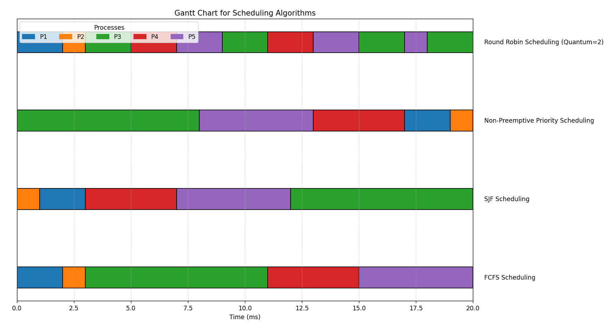

##### V202200664 - Luu Nguyen Chi Duc

# Operating System Lab 03

## Part A - Theory Questions

### 1. CPU Scheduling Algorithms

#### a. Draw 4 Gantt charts.

<div style="text-align: center; margin-top: 20px">
    
</div>

#### b. What is the turnaround time of each process for each of the scheduling algorithms?

_FCFS Scheduling:_

    P[1]: 2 ms
    P[2]: 3 ms
    P[3]: 11 ms
    P[4]: 15 ms
    P[5]: 20 ms

_SJF Scheduling:_

    P[2]: 1 ms
    P[1]: 3 ms
    P[4]: 7 ms
    P[5]: 12 ms
    P[3]: 20 ms

_Round Robin Scheduling (Time Quantum = 2):_

    P[1]: 2 ms
    P[2]: 3 ms
    P[3]: 20 ms
    P[4]: 13 ms
    P[5]: 18 ms

_Priority Scheduling:_

    P[3]: 8 ms
    P[5]: 13 ms
    P[4]: 17 ms
    P[1]: 19 ms
    P[2]: 20 ms

#### c. What is the waiting time of each process for each of these scheduling algorithms?

_FCFS Scheduling:_

    P[1]: 0 ms
    P[2]: 2 ms
    P[3]: 3 ms
    P[4]: 11 ms
    P[5]: 15 ms

_SJF Scheduling:_

    P[2]: 0 ms
    P[1]: 1 ms
    P[4]: 3 ms
    P[5]: 7 ms
    P[3]: 12 ms

_Round Robin Scheduling (Time Quantum = 2):_

    P[1]: 0 ms
    P[2]: 2 ms
    P[3]: 12 ms
    P[4]: 9 ms
    P[5]: 13 ms

_Priority Scheduling:_

    P[3]: 0 ms
    P[5]: 8 ms
    P[4]: 13 ms
    P[1]: 17 ms
    P[2]: 19 ms

#### d. Which of the algorithms results in the minimum average waiting time (over all processes)?

_Average Waiting Times for Different Algorithms:_

    Shortest Job First (SJF): 4.60 ms
    First-Come, First-Served (FCFS): 6.20 ms
    Round Robin (Time Quantum = 2): 7.20 ms
    Priority Scheduling: 11.40 ms

The Shortest Job First (SJF) scheduling algorithm results in the minimum average waiting time of 4.60 ms.

---

### 2. Scheduling Criteria Conflict

**CPU utilization vs. Response Time:** Maximizing CPU utilization may conflict with minimizing response time. High CPU utilization often means fewer idle times, which may lead to longer response times for interactive processes.

- Example: High CPU usage from tasks like video rendering can delay response times for new tasks, like opening a browser.

**Average Turnaround Time vs. Maximum Waiting Time:** Minimizing average turnaround time may not guarantee that individual processes won't experience long waiting times, especially for lower-priority or larger tasks.

- Example: Shortest Job First (SJF) minimizes average turnaround time, but longer processes may wait a long time if shorter ones keep arriving.

**I/O Device Utilization vs. CPU Utilization:** High CPU utilization may limit I/O device utilization, as CPU-bound processes may prevent I/O-bound processes from frequently accessing I/O devices, leading to suboptimal I/O utilization.

- Example: In a CPU-heavy system, I/O-bound tasks may be delayed, reducing I/O device efficiency.

---

## Part B - Programming Questions

### Task 1: First-Come, First-Served (FCFS) Scheduling

**Code `fcfs_scheduling.c`:**

```c
#include <stdio.h>

int main()
{
    int n, i;
    int burst_time[20], wait_time[20], tat[20];
    int total_wt = 0, total_tat = 0;

    printf("Enter the number of processes: ");
    scanf("%d", &n);

    printf("Enter burst time for each process:\n");
    for (i = 0; i < n; i++)
    {
        printf("P[%d]: ", i + 1);
        scanf("%d", &burst_time[i]);
    }

    wait_time[0] = 0; // Waiting time for the first process is 0

    // Calculate waiting time
    for (i = 1; i < n; i++)
    {
        wait_time[i] = burst_time[i - 1] + wait_time[i - 1];
        total_wt += wait_time[i];
    }

    // Calculate turnaround time
    for (i = 0; i < n; i++)
    {
        tat[i] = burst_time[i] + wait_time[i];
        total_tat += tat[i];
    }

    printf("\nProcess\tBurst Time\tWaiting Time\tTurnaround Time\n");
    for (i = 0; i < n; i++)
    {
        printf("P[%d]\t\t%d\t\t%d\t\t%d\n", i + 1, burst_time[i], wait_time[i], tat[i]);
    }

    printf("\nAverage Waiting Time: %.2f", (float)total_wt / n);
    printf("\nAverage Turnaround Time: %.2f\n", (float)total_tat / n);

    return 0;
}
```

**Output:**

<div style="text-align: center; margin-top: 20px">
    
</div>

---

### Task 2: Shortest Job First (SJF) Scheduling

**Code `sjf_scheduling.c`:**

```c
#include <stdio.h>
#include <stdlib.h>

typedef struct
{
    int id;
    int bt;
    int wt;
    int tat;
} Process;

int compare(const void *a, const void *b)
{
    return ((Process *)a)->bt - ((Process *)b)->bt;
}

int main()
{
    int n, i;
    int total_wt = 0, total_tat = 0;

    printf("Enter the number of processes: ");
    scanf("%d", &n);

    Process processes[n];

    printf("Enter burst time for each process:\n");
    for (i = 0; i < n; i++)
    {
        processes[i].id = i + 1;
        printf("P[%d]: ", processes[i].id);
        scanf("%d", &processes[i].bt);
    }

    qsort(processes, n, sizeof(Process), compare);

    processes[0].wt = 0;

    for (i = 1; i < n; i++)
    {
        processes[i].wt = processes[i - 1].bt + processes[i - 1].wt;
        total_wt += processes[i].wt;
    }

    for (i = 0; i < n; i++)
    {
        processes[i].tat = processes[i].bt + processes[i].wt;
        total_tat += processes[i].tat;
    }

    printf("\nProcess\tBurst Time\tWaiting Time\tTurnaround Time\n");
    for (i = 0; i < n; i++)
    {
        printf("P[%d]\t\t%d\t\t%d\t\t%d\n", processes[i].id, processes[i].bt, processes[i].wt, processes[i].tat);
    }

    printf("\nAverage Waiting Time: %.2f", (float)total_wt / n);
    printf("\nAverage Turnaround Time: %.2f\n", (float)total_tat / n);

    return 0;
}
```

**Output:**

<div style="text-align: center; margin-top: 20px">
    
</div>

---

### Task 3: Round Robin (RR) Scheduling

**Code `rr_scheduling.c`:**

```c
#include <stdio.h>
int main()
{
    int n, i, tq, count = 0, temp, sq = 0;
    int burst_time[10], rem_bt[10], wait_time[10], tat[10];
    float avg_wt = 0, avg_tat = 0;

    printf("Enter the number of processes: ");
    scanf("%d", &n);
    printf("Enter the time quantum: ");
    scanf("%d", &tq);
    printf("Enter burst time for each process:\n");

    for (i = 0; i < n; i++)
    {
        printf("P[%d]: ", i + 1);
        scanf("%d", &burst_time[i]);
        rem_bt[i] = burst_time[i];
    }
    while (1)
    {
        int done = 1;
        for (i = 0; i < n; i++)
        {
            if (rem_bt[i] > 0)
            {
                done = 0; // There is a pending process
                if (rem_bt[i] > tq)
                {
                    sq += tq;
                    rem_bt[i] -= tq;
                }
                else
                {
                    sq += rem_bt[i];
                    wait_time[i] = sq - burst_time[i];
                    rem_bt[i] = 0;
                }
            }
        }
        if (done == 1)
            break;
    }

    for (i = 0; i < n; i++)
    {
        tat[i] = burst_time[i] + wait_time[i];
        avg_wt += wait_time[i];
        avg_tat += tat[i];
    }

    printf("\nProcess\tBurst Time\tWaiting Time\tTurnaround Time\n");

    for (i = 0; i < n; i++)
    {
        printf("P[%d]\t\t%d\t\t%d\t\t%d\n", i + 1, burst_time[i], wait_time[i], tat[i]);
    }

    printf("\nAverage Waiting Time: %.2f", avg_wt / n);
    printf("\nAverage Turnaround Time: %.2f\n", avg_tat / n);

    return 0;
}
```

**Output:**

<div style="text-align: center; margin-top: 20px">
    
</div>

---

### Task 4: Priority Scheduling

**Code `priority_scheduling.c`:**

```c
#include <stdio.h>

int main()
{
    int n, i, j, temp;
    int bt[20], wt[20], tat[20], pr[20], p[20];
    int total_wt = 0, total_tat = 0;

    printf("Enter the number of processes: ");
    scanf("%d", &n);

    printf("Enter burst time and priority for each process:\n");
    for (i = 0; i < n; i++)
    {
        printf("P[%d] - Burst Time: ", i + 1);
        scanf("%d", &bt[i]);
        printf("P[%d] - Priority: ", i + 1);
        scanf("%d", &pr[i]);
        p[i] = i + 1;
    }

    // Sort processes by priority
    for (i = 0; i < n - 1; i++)
    {
        for (j = i + 1; j < n; j++)
        {
            if (pr[i] < pr[j])
            {
                temp = pr[i];
                pr[i] = pr[j];
                pr[j] = temp;

                temp = bt[i];
                bt[i] = bt[j];
                bt[j] = temp;

                temp = p[i];
                p[i] = p[j];
                p[j] = temp;
            }
        }
    }

    wt[0] = 0;

    // Calculate waiting time
    for (i = 1; i < n; i++)
    {
        wt[i] = bt[i - 1] + wt[i - 1];
        total_wt += wt[i];
    }

    // Calculate turnaround time
    for (i = 0; i < n; i++)
    {
        tat[i] = bt[i] + wt[i];
        total_tat += tat[i];
    }

    printf("\nProcess\tBurst Time\tPriority\tWaiting Time\tTurnaround Time\n");
    for (i = 0; i < n; i++)
    {
        printf("P[%d]\t\t%d\t\t%d\t\t%d\t\t%d\n", p[i], bt[i], pr[i], wt[i], tat[i]);
    }

    printf("\nAverage Waiting Time: %.2f", (float)total_wt / n);
    printf("\nAverage Turnaround Time: %.2f\n", (float)total_tat / n);

    return 0;
}
```

**Output:**

<div style="text-align: center; margin-top: 20px">
    
</div>

---

### Task 5: Measure Context Switches

**Code `context_switch_counter.c`:**

```c
#include <stdio.h>
#include <stdbool.h>

int main()
{
    int n, i, tq, time = 0, context_switches = 0;
    bool done;

    printf("Enter the number of processes: ");
    scanf("%d", &n);

    int bt[n], rem_bt[n], at[n], wt[n], tat[n];

    printf("Enter the time quantum: ");
    scanf("%d", &tq);

    printf("Enter burst time and arrival time for each process:\n");
    for (i = 0; i < n; i++)
    {
        printf("P[%d] - Burst Time: ", i + 1);
        scanf("%d", &bt[i]);
        printf("P[%d] - Arrival Time: ", i + 1);
        scanf("%d", &at[i]);
        rem_bt[i] = bt[i];
        wt[i] = 0;
    }

    while (1)
    {
        done = true;

        for (i = 0; i < n; i++)
        {
            if (rem_bt[i] > 0 && at[i] <= time)
            {

                done = false;

                if (rem_bt[i] > tq)
                {
                    time += tq;
                    rem_bt[i] -= tq;

                    context_switches++;

                    for (int j = 0; j < n; j++)
                    {
                        if (j != i && rem_bt[j] > 0 && at[j] <= time)
                            wt[j] += tq;
                    }
                }
                else
                {
                    time += rem_bt[i];
                    rem_bt[i] = 0;

                    wt[i] = time - bt[i] - at[i];

                    context_switches++;
                }
            }
        }

        if (done == true)
            break;
    }

    int total_wt = 0, total_tat = 0;
    for (i = 0; i < n; i++)
    {
        tat[i] = bt[i] + wt[i];
        total_wt += wt[i];
        total_tat += tat[i];
    }

    printf("\nProcess\tBurst Time\tArrival Time\tWaiting Time\tTurnaround Time\n");
    for (i = 0; i < n; i++)
    {
        printf("P[%d]\t\t%d\t\t%d\t\t%d\t\t%d\n", i + 1, bt[i], at[i], wt[i], tat[i]);
    }

    printf("\nTotal Context Switches: %d", context_switches);
    printf("\nAverage Waiting Time: %.2f", (float)total_wt / n);
    printf("\nAverage Turnaround Time: %.2f\n", (float)total_tat / n);

    return 0;
}
```

**Output:**

<div style="text-align: center; margin-top: 20px">
    
</div>

---

## Part C - Bonus Question

### Race Condition

**What is race condition? Example of Race Condition in C?**

A **race condition** occurs when two or more threads access shared data and attempt to change it simultaneously. The final outcome depends on the order in which the threads execute, which may lead to unpredictable or incorrect results.

**Original Example Code:**

```c
#include <stdio.h>
#include <pthread.h>

int shared_data = 0;

void* increment(void* arg) {
    for (int i = 0; i < 100000; i++) {
        shared_data++;
    }
    return NULL;
}

int main() {
    pthread_t thread1, thread2;
    pthread_create(&thread1, NULL, increment, NULL);
    pthread_create(&thread2, NULL, increment, NULL);
    pthread_join(thread1, NULL);
    pthread_join(thread2, NULL);
    printf("Final value of shared_data: %d\n", shared_data);
    return 0;
}
```

**Output:**

<div style="text-align: center; margin-top: 20px">
    
</div>

**Explaination:**

The expected output is `200,000` (since both threads increment shared_data by `100,000`). However, due to the race condition, the actual output is often less and varies each time.

This happens because `shared_data++` involves three steps: reading the value, incrementing it, and writing it back. If two threads read the same value simultaneously, one increment is lost, leading to an unpredictable final result.

**Corrected Code Using Mutex:**

```c
#include <stdio.h>
#include <pthread.h>

int shared_data = 0;
pthread_mutex_t lock;

void* increment(void* arg) {
    for (int i = 0; i < 100000; i++) {
        pthread_mutex_lock(&lock);  // Lock the critical section
        shared_data++;
        pthread_mutex_unlock(&lock);  // Unlock the critical section
    }
    return NULL;
}

int main() {
    pthread_t thread1, thread2;
    pthread_mutex_init(&lock, NULL);  // Initialize the mutex

    pthread_create(&thread1, NULL, increment, NULL);
    pthread_create(&thread2, NULL, increment, NULL);

    pthread_join(thread1, NULL);
    pthread_join(thread2, NULL);

    printf("Final value of shared_data: %d\n", shared_data);

    pthread_mutex_destroy(&lock);  // Destroy the mutex
    return 0;
}
```

**Output:**

<div style="text-align: center; margin-top: 20px">
    
</div>

**Explaination:**

- **Mutex `(pthread_mutex_t lock)`**: Ensures mutual exclusion, allowing only one thread to enter the critical section at a time.

- **`pthread_mutex_lock(&lock)`**: Locks the critical section, preventing other threads from modifying shared_data simultaneously.

- **`pthread_mutex_unlock(&lock)`**: Unlocks the critical section, allowing other threads access.

Using the mutex makes the increment operation atomic, ensuring all increments are accounted for without interruption.
