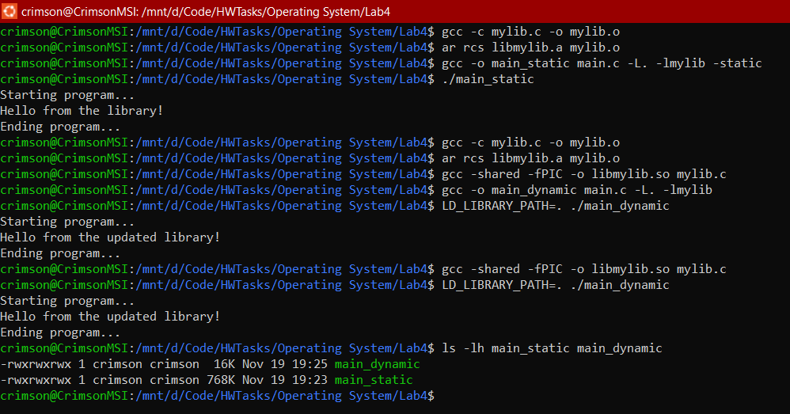

##### V202200664 - Luu Nguyen Chi Duc

# Operating System Lab 05

## Part A - Theory Questions

### **Basic concepts**

### 1. Internal vs. External Fragmentation

**Internal Fragmentation** is the wasted space within allocated memory blocks when the requested memory is smaller than the allocated block. This occurs because memory tends to be allocated in either fixed blocks or segments. If a request does not exactly match the block sizes, then the remainder unusable space within the block is wasted but still marked as in use.

**External Fragmentation** is the wasted space in system memory due to free memory being broken into small blocks and scattered all over the place, non-contiguous. It happens because memory is freed in an unspecified order, and after a long time, the system ends up having many small free blocks between allocated blocks. That can prevent the allocation of larger blocks, even though the total free memory might be sufficient.

### 2. OS Page Replacement Algorithms

Operating systems use page replacement algorithms to decide which memory pages to swap out, write to disk when a page fault occurs, and the required page is not in memory. These algorithms help manage the limited physical memory and optimize the use of the available memory space.

When the physical memory completely filled and a new page needs to be loaded, these algorithms help in determining which existing pages should be replaced, with the aim of minimizing the occurrence of page faults and hence decreasing program execution time.

### 3. Handling Processes with Contiguous Memory Allocation Algorithms

Given memory holes of sizes 100K, 500K, 200K, 300K, and 600K and processes requiring 212K, 417K, 112K, and 426K:

_First-fit:_

    212K is allocated to the 500K hole.
    417K is then allocated to the 600K hole.
    112K goes to the 200K hole.
    426K cannot be allocated as no suitable hole remains.
    Resulting holes: 100K, 288K (500-212), 88K (200-112), 300K, 183K (600-417).

_Best-fit:_

    212K is best fitted into 300K hole.
    417K fits best into 500K hole.
    112K is then allocated to the 200K hole.
    426K goes to the 600K hole.
    Resulting holes: 100K, 83K (500-417), 88K (200-112), 88K (300-212), 174K (600-426).

_Worst-fit:_

    212K is allocated to the 600K hole.
    417K then goes to the 500K hole.
    112K goes to the 300K hole.
    426K cannot be allocated as no suitable hole remains.
    Resulting holes: 100K, 83K (500-417), 200K, 188K (300-112), 388K (600-212).

**Graph:**

<div style="text-align: center; margin-top: 20px">
    
</div>

### 4. Most Efficient Contiguous Allocation Algorithm

Best-Fit will always use memory most efficiently because it leaves the smallest average size of a hole, thereby reducing external fragmentation and giving the maximum possibility of taking future allocations. However, it can be slower since every allocation has to find the best block.

---

### **Consider a computer system with a 32-bit logical address and 8-KB page size. The system supports up to 1 GB of physical memory.**

**Code**

```py
# I can't write formula in markdown so I code instead :))
# 1. Calculate the number of entries in a single-level page table
logical_address_bits = 32
page_size_bits = 13 # 8KB = 2^13
number_of_pages = 2 ** (logical_address_bits - page_size_bits)
print(f"1. Number of entries in a single-level page table: {number_of_pages} entries")

# 2. Calculate the time for a paged memory reference
memory_reference_time_ns = 30
paged_memory_reference_time_ns = memory_reference_time_ns * 2  # Two accesses: page table and physical memory
print(f"2. Time for a paged memory reference: {paged_memory_reference_time_ns} ns")
```

**Answer**

    1. Number of entries in a single-level page table: 524288 entries
    2. Time for a paged memory reference: 60 ns

---

## Part B - Programming Questions

### Task 1: Hardware Address Protection

**Code `hw_adr_protection.c`:**

```c
#include <stdio.h>
#include <stdlib.h>
#include <unistd.h>
#include <sys/types.h>
#include <sys/wait.h>
int globalVar = 0; // Global variable shared among processes
int main()
{
    printf("Parent Process: Initial globalVar = %d\n", globalVar);
    for (int i = 0; i < 10; i++)
    {
        pid_t pid = fork(); // Create a child process
        if (pid < 0)
        {
            perror("Fork failed");
            exit(1);
        }
        if (pid == 0)
        {
            // Child process
            printf("Child %d: Initial globalVar = %d\n", i, globalVar);
            // Modify the global variable
            globalVar += (i + 1) * 10;
            printf("Child %d: Modified globalVar = %d\n", i, globalVar);
            // Exit child process
            exit(0);
        }
    }
    // Wait for all child processes to finish
    for (int i = 0; i < 10; i++)
    {
        wait(NULL);
    }
    printf("Parent Process: Final globalVar = %d\n", globalVar);
    return 0;
}

```

**Output:**

<div style="text-align: center; margin-top: 20px; margin-bottom: 20px">
    
</div>

**Explaination**

This C program demonstrates how the `fork()` system call creates child processes that inherit the parent process's memory space, each with its own independent address space. The global variable `globalVar` is initialized in the parent process, and changes made by a child process **do not affect** the parent process or other child processes.

The final `globalVar` value remains `0` after exiting the child processes.

---

### Task 2: Address Binding

**Code `adr_binding.c`:**

```c
#include <stdio.h>
int globalVar = 42; // Global variable
int main()
{
    int localVar = 10; // Local variable
    printf("Value of globalVar: %d\n", globalVar);
    printf("Value of localVar: %d\n", localVar);
    return 0;
}
```

**Terminal:**

```ps
crimson@CrimsonMSI:/mnt/d/Code/HWTasks/Operating System/Lab4$ gcc adr_binding.c -o adr_binding
crimson@CrimsonMSI:/mnt/d/Code/HWTasks/Operating System/Lab4$ ./adr_binding
Value of globalVar: 42
Value of localVar: 10
crimson@CrimsonMSI:/mnt/d/Code/HWTasks/Operating System/Lab4$ gcc -g -o adr_binding adr_binding.c
crimson@CrimsonMSI:/mnt/d/Code/HWTasks/Operating System/Lab4$ objdump -d -M intel adr_binding

adr_binding:     file format elf64-x86-64


Disassembly of section .init:

0000000000001000 <_init>:
    1000:       f3 0f 1e fa             endbr64
    1004:       48 83 ec 08             sub    rsp,0x8
    1008:       48 8b 05 d9 2f 00 00    mov    rax,QWORD PTR [rip+0x2fd9]        # 3fe8 <__gmon_start__@Base>
    100f:       48 85 c0                test   rax,rax
    1012:       74 02                   je     1016 <_init+0x16>
    1014:       ff d0                   call   rax
    1016:       48 83 c4 08             add    rsp,0x8
    101a:       c3                      ret

Disassembly of section .plt:

0000000000001020 <.plt>:
    1020:       ff 35 9a 2f 00 00       push   QWORD PTR [rip+0x2f9a]        # 3fc0 <_GLOBAL_OFFSET_TABLE_+0x8>
    1026:       ff 25 9c 2f 00 00       jmp    QWORD PTR [rip+0x2f9c]        # 3fc8 <_GLOBAL_OFFSET_TABLE_+0x10>
    102c:       0f 1f 40 00             nop    DWORD PTR [rax+0x0]
    1030:       f3 0f 1e fa             endbr64
    1034:       68 00 00 00 00          push   0x0
    1039:       e9 e2 ff ff ff          jmp    1020 <_init+0x20>
    103e:       66 90                   xchg   ax,ax

Disassembly of section .plt.got:

0000000000001040 <__cxa_finalize@plt>:
    1040:       f3 0f 1e fa             endbr64
    1044:       ff 25 ae 2f 00 00       jmp    QWORD PTR [rip+0x2fae]        # 3ff8 <__cxa_finalize@GLIBC_2.2.5>
    104a:       66 0f 1f 44 00 00       nop    WORD PTR [rax+rax*1+0x0]

Disassembly of section .plt.sec:

0000000000001050 <printf@plt>:
    1050:       f3 0f 1e fa             endbr64
    1054:       ff 25 76 2f 00 00       jmp    QWORD PTR [rip+0x2f76]        # 3fd0 <printf@GLIBC_2.2.5>
    105a:       66 0f 1f 44 00 00       nop    WORD PTR [rax+rax*1+0x0]

Disassembly of section .text:

0000000000001060 <_start>:
    1060:       f3 0f 1e fa             endbr64
    1064:       31 ed                   xor    ebp,ebp
    1066:       49 89 d1                mov    r9,rdx
    1069:       5e                      pop    rsi
    106a:       48 89 e2                mov    rdx,rsp
    106d:       48 83 e4 f0             and    rsp,0xfffffffffffffff0
    1071:       50                      push   rax
    1072:       54                      push   rsp
    1073:       45 31 c0                xor    r8d,r8d
    1076:       31 c9                   xor    ecx,ecx
    1078:       48 8d 3d ca 00 00 00    lea    rdi,[rip+0xca]        # 1149 <main>
    107f:       ff 15 53 2f 00 00       call   QWORD PTR [rip+0x2f53]        # 3fd8 <__libc_start_main@GLIBC_2.34>
    1085:       f4                      hlt
    1086:       66 2e 0f 1f 84 00 00    cs nop WORD PTR [rax+rax*1+0x0]
    108d:       00 00 00

0000000000001090 <deregister_tm_clones>:
    1090:       48 8d 3d 81 2f 00 00    lea    rdi,[rip+0x2f81]        # 4018 <__TMC_END__>
    1097:       48 8d 05 7a 2f 00 00    lea    rax,[rip+0x2f7a]        # 4018 <__TMC_END__>
    109e:       48 39 f8                cmp    rax,rdi
    10a1:       74 15                   je     10b8 <deregister_tm_clones+0x28>
    10a3:       48 8b 05 36 2f 00 00    mov    rax,QWORD PTR [rip+0x2f36]        # 3fe0 <_ITM_deregisterTMCloneTable@Base>
    10aa:       48 85 c0                test   rax,rax
    10ad:       74 09                   je     10b8 <deregister_tm_clones+0x28>
    10af:       ff e0                   jmp    rax
    10b1:       0f 1f 80 00 00 00 00    nop    DWORD PTR [rax+0x0]
    10b8:       c3                      ret
    10b9:       0f 1f 80 00 00 00 00    nop    DWORD PTR [rax+0x0]

00000000000010c0 <register_tm_clones>:
    10c0:       48 8d 3d 51 2f 00 00    lea    rdi,[rip+0x2f51]        # 4018 <__TMC_END__>
    10c7:       48 8d 35 4a 2f 00 00    lea    rsi,[rip+0x2f4a]        # 4018 <__TMC_END__>
    10ce:       48 29 fe                sub    rsi,rdi
    10d1:       48 89 f0                mov    rax,rsi
    10d4:       48 c1 ee 3f             shr    rsi,0x3f
    10d8:       48 c1 f8 03             sar    rax,0x3
    10dc:       48 01 c6                add    rsi,rax
    10df:       48 d1 fe                sar    rsi,1
    10e2:       74 14                   je     10f8 <register_tm_clones+0x38>
    10e4:       48 8b 05 05 2f 00 00    mov    rax,QWORD PTR [rip+0x2f05]        # 3ff0 <_ITM_registerTMCloneTable@Base>    10eb:       48 85 c0                test   rax,rax
    10ee:       74 08                   je     10f8 <register_tm_clones+0x38>
    10f0:       ff e0                   jmp    rax
    10f2:       66 0f 1f 44 00 00       nop    WORD PTR [rax+rax*1+0x0]
    10f8:       c3                      ret
    10f9:       0f 1f 80 00 00 00 00    nop    DWORD PTR [rax+0x0]

0000000000001100 <__do_global_dtors_aux>:
    1100:       f3 0f 1e fa             endbr64
    1104:       80 3d 09 2f 00 00 00    cmp    BYTE PTR [rip+0x2f09],0x0        # 4014 <completed.0>
    110b:       75 2b                   jne    1138 <__do_global_dtors_aux+0x38>
    110d:       55                      push   rbp
    110e:       48 83 3d e2 2e 00 00    cmp    QWORD PTR [rip+0x2ee2],0x0        # 3ff8 <__cxa_finalize@GLIBC_2.2.5>
    1115:       00
    1116:       48 89 e5                mov    rbp,rsp
    1119:       74 0c                   je     1127 <__do_global_dtors_aux+0x27>
    111b:       48 8b 3d e6 2e 00 00    mov    rdi,QWORD PTR [rip+0x2ee6]        # 4008 <__dso_handle>
    1122:       e8 19 ff ff ff          call   1040 <__cxa_finalize@plt>
    1127:       e8 64 ff ff ff          call   1090 <deregister_tm_clones>
    112c:       c6 05 e1 2e 00 00 01    mov    BYTE PTR [rip+0x2ee1],0x1        # 4014 <completed.0>
    1133:       5d                      pop    rbp
    1134:       c3                      ret
    1135:       0f 1f 00                nop    DWORD PTR [rax]
    1138:       c3                      ret
    1139:       0f 1f 80 00 00 00 00    nop    DWORD PTR [rax+0x0]

0000000000001140 <frame_dummy>:
    1140:       f3 0f 1e fa             endbr64
    1144:       e9 77 ff ff ff          jmp    10c0 <register_tm_clones>

0000000000001149 <main>:
    1149:       f3 0f 1e fa             endbr64
    114d:       55                      push   rbp
    114e:       48 89 e5                mov    rbp,rsp
    1151:       48 83 ec 10             sub    rsp,0x10
    1155:       c7 45 fc 0a 00 00 00    mov    DWORD PTR [rbp-0x4],0xa
    115c:       8b 05 ae 2e 00 00       mov    eax,DWORD PTR [rip+0x2eae]        # 4010 <globalVar>
    1162:       89 c6                   mov    esi,eax
    1164:       48 8d 05 99 0e 00 00    lea    rax,[rip+0xe99]        # 2004 <_IO_stdin_used+0x4>
    116b:       48 89 c7                mov    rdi,rax
    116e:       b8 00 00 00 00          mov    eax,0x0
    1173:       e8 d8 fe ff ff          call   1050 <printf@plt>
    1178:       8b 45 fc                mov    eax,DWORD PTR [rbp-0x4]
    117b:       89 c6                   mov    esi,eax
    117d:       48 8d 05 98 0e 00 00    lea    rax,[rip+0xe98]        # 201c <_IO_stdin_used+0x1c>
    1184:       48 89 c7                mov    rdi,rax
    1187:       b8 00 00 00 00          mov    eax,0x0
    118c:       e8 bf fe ff ff          call   1050 <printf@plt>
    1191:       b8 00 00 00 00          mov    eax,0x0
    1196:       c9                      leave
    1197:       c3                      ret

Disassembly of section .fini:

0000000000001198 <_fini>:
    1198:       f3 0f 1e fa             endbr64
    119c:       48 83 ec 08             sub    rsp,0x8
    11a0:       48 83 c4 08             add    rsp,0x8
    11a4:       c3                      ret
```

### Task 3: Dynamic Linking and Shared Libraries

**Output:**

<div style="text-align: center; margin-top: 20px; margin-bottom: 20px">
    
</div>

**Explaination:**

The statically linked program is larger due to its inclusion of library code, while the dynamically linked program references a shared library.

Changes to the library do not affect the program unless recompiled, while dynamic linking reflects the updated library without recompiling.

### Task 4: Contiguous Memory Allocation

In contiguous memory allocation, each memory block is allocated to a single process. So once allocated:

- The process occupies the memory block.
- Any unused space in the block (internal fragmentation) remains reserved for that process.

**Code `cont_memo_alloc.c`:**

```c
#include <stdio.h>

void firstFit(int blockSize[], int m, int processSize[], int n)
{
    int allocation[n];
    int internalFrag[n];
    for (int i = 0; i < n; i++)
    {
        allocation[i] = -1;
        internalFrag[i] = 0;
    }

    for (int i = 0; i < n; i++)
    {
        for (int j = 0; j < m; j++)
            if (blockSize[j] >= processSize[i])
            {
                allocation[i] = j;
                internalFrag[i] = blockSize[j] - processSize[i];
                blockSize[j] -= processSize[i];
                break;
            }
    }

    int externalFrag = 0;
    for (int j = 0; j < m; j++)
        externalFrag += blockSize[j];

    printf("\nFirst Fit:\n");
    printf("Process No.\tProcess Size\tBlock No.\tInternal Fragmentation\n");

    for (int i = 0; i < n; i++)
    {
        printf("%d\t\t%d\t\t", i + 1, processSize[i]);
        if (allocation[i] != -1)
            printf("%d\t\t%d\n", allocation[i] + 1, internalFrag[i]);
        else
            printf("Not Allocated\t-\n");
    }

    printf("Total External Fragmentation: %d KB\n", externalFrag);
}

void bestFit(int blockSize[], int m, int processSize[], int n)
{
    int allocation[n];
    int internalFrag[n];
    for (int i = 0; i < n; i++)
    {
        allocation[i] = -1;
        internalFrag[i] = 0;
    }

    for (int i = 0; i < n; i++)
    {
        int bestIdx = -1;
        for (int j = 0; j < m; j++)
            if (blockSize[j] >= processSize[i])
                if (bestIdx == -1 || blockSize[j] < blockSize[bestIdx])
                    bestIdx = j;

        if (bestIdx != -1)
        {
            allocation[i] = bestIdx;
            internalFrag[i] = blockSize[bestIdx] - processSize[i];
            blockSize[bestIdx] -= processSize[i];
        }
    }

    int externalFrag = 0;
    for (int j = 0; j < m; j++)
        externalFrag += blockSize[j];

    printf("\nBest Fit:\n");
    printf("Process No.\tProcess Size\tBlock No.\tInternal Fragmentation\n");

    for (int i = 0; i < n; i++)
    {
        printf("%d\t\t%d\t\t", i + 1, processSize[i]);
        if (allocation[i] != -1)
            printf("%d\t\t%d\n", allocation[i] + 1, internalFrag[i]);

        else
            printf("Not Allocated\t-\n");
    }
    printf("Total External Fragmentation: %d KB\n", externalFrag);
}

void worstFit(int blockSize[], int m, int processSize[], int n)
{
    int allocation[n];
    int internalFrag[n];
    for (int i = 0; i < n; i++)
    {
        allocation[i] = -1;
        internalFrag[i] = 0;
    }

    for (int i = 0; i < n; i++)
    {
        int worstIdx = -1;
        for (int j = 0; j < m; j++)
            if (blockSize[j] >= processSize[i])
                if (worstIdx == -1 || blockSize[j] > blockSize[worstIdx])
                    worstIdx = j;

        if (worstIdx != -1)
        {
            allocation[i] = worstIdx;
            internalFrag[i] = blockSize[worstIdx] - processSize[i];
            blockSize[worstIdx] -= processSize[i];
        }
    }

    int externalFrag = 0;
    for (int j = 0; j < m; j++)
        externalFrag += blockSize[j];

    printf("\nWorst Fit:\n");
    printf("Process No.\tProcess Size\tBlock No.\tInternal Fragmentation\n");

    for (int i = 0; i < n; i++)
    {
        printf("%d\t\t%d\t\t", i + 1, processSize[i]);
        if (allocation[i] != -1)
            printf("%d\t\t%d\n", allocation[i] + 1, internalFrag[i]);

        else
            printf("Not Allocated\t-\n");
    }
    printf("Total External Fragmentation: %d KB\n", externalFrag);
}

int main()
{
    int blockSize1[] = {150, 350, 400, 200, 300};
    int processSize[] = {300, 200, 400, 150, 100};
    int m = sizeof(blockSize1) / sizeof(blockSize1[0]);
    int n = sizeof(processSize) / sizeof(processSize[0]);

    int blockSize2[m], blockSize3[m];
    for (int i = 0; i < m; i++)
    {
        blockSize2[i] = blockSize1[i];
        blockSize3[i] = blockSize1[i];
    }

    firstFit(blockSize1, m, processSize, n);
    bestFit(blockSize2, m, processSize, n);
    worstFit(blockSize3, m, processSize, n);

    return 0;
}

```

**Output:**

<div style="text-align: center; margin-top: 20px; margin-bottom: 20px">
    
</div>

**Graph:**

<div style="text-align: center; margin-top: 20px; margin-bottom: 20px">
    
</div>

### Task 5: Paging

The answer for small parts has already been in this lab:

<div style="text-align: center; margin-top: 20px; margin-bottom: 20px">
    
</div>

**Answer:**

Internal fragmentation occurs when a process doesn't fully utilize its page, leaving unused space. Therefore, the worst case occurs when a process uses 1 byte more than a multiple of the page size, leaving the rest unused.

Worst case calculation is:

     Page Size - 1 = 1024 - 1 = 1023 byte.

### Task 6: A translation look-aside buffer(TLB)

#### Minimum TLB Entries

The minimum number of TLB entries required to support the working set size for one process is calculated as:

    Number of Pages in Working Set = Working Set Size / Page Size = 256KB / 4KB = 64 Entries

Hence, minimum TLB entries required: 64.

#### What Happens If There Are More TLB Entries?

Benefit:

- Additional TLB entries cache page mappings that are beyond the working set size.
- Fewer TLB misses for pages not part of the working set and better overall system performance-especially for processes that frequently reference larger amounts of memory.
- Support for multiple processes in parallel without replacing TLB entries very frequently.

Downside:

- More hardware memory needed.
- There is a little longer latency in TLB lookup due to a larger table.

#### What Happens If There Are Fewer TLB Entries?

Problem:

- The TLB will not be able to cache the working set of the process completely.
- This results in a high TLB miss rate and high overhead to search page tables in main memory.
- A great performance penalty if the system has to keep replacing the TLB entries constantly.

Effect:

- More page faults and increased latency on memory, hence slowing down the system.
- The CPU might stall waiting for memory operations to complete.

### Task 7: 2-level page-table

**Code `two_lvl_paging.c`:**

```c
// Since array cannot handle big number, I modified the code a bit.
#include <stdio.h>
#include <stdlib.h>

#define ULL unsigned long long
#define PAGE_SIZE 4096UL                                                           // Page size (4 KB)
#define PAGE_TABLE_SIZE 1024UL                                                     // Number of entries in each page table
#define PAGE_DIRECTORY_SIZE 1024UL                                                 // Number of entries in the page directory
#define PHYSICAL_MEMORY_SIZE 4294967296ULL // Total memory size

// Page directory entry and page table entry types
typedef ULL pte_t; // Page Table Entry
typedef ULL pde_t; // Page Directory Entry

// Simulate physical memory
unsigned char *physical_memory;

// Page directory and page tables
pde_t page_directory[PAGE_DIRECTORY_SIZE]; // Page directory
pte_t *page_table[PAGE_DIRECTORY_SIZE];    // Array of pointers to page tables

// Function to initialize the page tables and directory
void initialize_paging()
{
    physical_memory = malloc((size_t)PHYSICAL_MEMORY_SIZE);
    if (physical_memory == NULL) {
        printf("Error: Unable to allocate physical memory.\n");
        exit(1);
    }
    // Simulate 1024 page tables, each with 1024 entries
    for (int i = 0; i < PAGE_DIRECTORY_SIZE; i++)
    {
        page_directory[i] = i * PAGE_TABLE_SIZE;                          // Map each directory entry to a page table
        page_table[i] = (pte_t *)malloc(PAGE_TABLE_SIZE * sizeof(pte_t)); // Allocate memory for the page table

        // Simulate filling each page table with physical frames
        for (int j = 0; j < PAGE_TABLE_SIZE; j++)
        {
            page_table[i][j] = (i * PAGE_TABLE_SIZE + j) * PAGE_SIZE; // Map each page table entry to a physical frame
        }
    }
}

// Function to translate a virtual address to a physical address
ULL translate_address(ULL virtual_address)
{
    // Split the virtual address into page directory index, page table index, and offset
    ULL page_directory_index = (virtual_address >> 22) & 0x3FF; // Top 10 bits for page directory index
    ULL page_table_index = (virtual_address >> 12) & 0x3FF;     // Next 10 bits for page table index
    ULL offset = virtual_address & 0xFFF;                       // Last 12 bits for offset

    // Retrieve the page table pointer from the page directory
    pte_t *page_table_ptr = page_table[page_directory_index];

    // Check if the page table exists (page directory entry is valid)
    if (page_table_ptr == NULL)
    {
        printf("Invalid page directory entry!\n");
        return -1; // Indicate an invalid mapping
    }

    // Retrieve the physical address from the page table
    ULL physical_address = page_table_ptr[page_table_index] + offset;

    // Return the translated physical address
    return physical_address;
}

// Function to simulate accessing physical memory
void access_physical_memory(ULL physical_address)
{
    // Debugging
    printf("Checking PHYSICAL_MEMORY_SIZE: %llu\n", PHYSICAL_MEMORY_SIZE);
    printf("Checking physical address: %llu\n", physical_address);
    // Check if the physical address is within the allocated memory space
    if (physical_address < PHYSICAL_MEMORY_SIZE)
    {
        printf("IF branch entered: Physical address is within bounds.\n"); // Indicate that a number is too big to be simulated in array
        physical_memory[physical_address] = 1; // Mark the memory as accessed
        printf("Accessed physical memory at address: 0x%X\n", physical_address);
    }
    else
    {
        printf("ELSE branch entered: Physical address is invalid.\n"); // Indicate that a number is too big to be simulated in array
        printf("Invalid physical address: 0x%X\n", physical_address);
    }
}

int main()
{
    // Initialize the page directory and page tables
    initialize_paging();

    // Example virtual address to be translated
    ULL virtual_address = 0x12345678;

    // Print the virtual address
    printf("Virtual Address: 0x%X\n", virtual_address);

    // Translate the virtual address to a physical address
    ULL physical_address = translate_address(virtual_address);

    // If the translation is valid, access the physical memory
    if (physical_address != (ULL)-1)
    {
        printf("Physical Address: 0x%X\n", physical_address);
        access_physical_memory(physical_address);
    }

    // Free the allocated memory for the page tables
    for (int i = 0; i < PAGE_DIRECTORY_SIZE; i++)
    {
        free(page_table[i]);
    }

    return 0;
}
```

**Output:**

<div style="text-align: center; margin-top: 20px; margin-bottom: 20px">
    
</div>
<div style="text-align: center; margin-top: 20px; margin-bottom: 20px">
    
</div>

**Invalid Virtual Addresses in System**

- Invalid Page Directory Entry: The code checks if the page directory entry is valid. If invalid, the message `Invalid page directory entry!` is printed.
- Invalid Page Table Entry: If the virtual address is outside the valid range of allocated pages, the system fails to map the virtual address to a physical address.
- Invalid Physical Address: If the translated physical address exceeds the physical memory size, the system outputs `Invalid physical address: 0x.`

**Errors raised & System response:**

Raised when `page_table_ptr` is `NULL` (Invalid Page Directory Entry)

    Invalid page directory entry!

Raised when the computed physical address exceeds `PHYSICAL_MEMORY_SIZE` (Invalid Physical Address)

    Invalid physical address: `0x<address>`

So in an actual operating system, responding to invalid mapping, the operating system would either:

- Load the missing page into memory if it exists.
- Terminate the process if the address is truly invalid.

### Task 8: Hashed Page Tables

**Code `hash_table_page.c`:**

```c
#include <stdio.h>
#include <stdlib.h>
#define PAGE_SIZE 4096
#define NUM_ENTRIES 100


typedef struct PageTableEntry {
    unsigned long long virtual_address;
    unsigned long long physical_address;
    int valid;
    struct PageTableEntry* next;
} page_table_entry_t;


page_table_entry_t* hash_table[NUM_ENTRIES];
int page_fault_count = 0;


unsigned int hash(unsigned long long virtual_page) {
    return virtual_page % NUM_ENTRIES;
}


void initialize_hash_table() {
    for (int i = 0; i < NUM_ENTRIES; i++) {
        hash_table[i] = NULL;
    }
}


void insert(unsigned long long virtual_address, unsigned long long physical_address) {
    unsigned long long virtual_page = virtual_address / PAGE_SIZE;
    unsigned int index = hash(virtual_page);


    page_table_entry_t* new_entry = (page_table_entry_t*)malloc(sizeof(page_table_entry_t));
    new_entry->virtual_address = virtual_address;
    new_entry->physical_address = physical_address;
    new_entry->valid = 1;
    new_entry->next = NULL;


    if (hash_table[index] == NULL) {
        hash_table[index] = new_entry;
    } else {
        new_entry->next = hash_table[index];
        hash_table[index] = new_entry;
    }
}


unsigned long long lookup(unsigned long long virtual_address) {
    unsigned long long virtual_page = virtual_address / PAGE_SIZE;
    unsigned int index = hash(virtual_page);


    page_table_entry_t* current = hash_table[index];
    while (current != NULL) {
        if (current->valid && current->virtual_address == virtual_address) {
            return current->physical_address;
        }
        current = current->next;
    }


    page_fault_count++;
    printf("Page fault for virtual address 0x%llX\n", virtual_address);
    return -1;
}


void free_hash_table() {
    for (int i = 0; i < NUM_ENTRIES; i++) {
        page_table_entry_t* current = hash_table[i];
        while (current != NULL) {
            page_table_entry_t* temp = current;
            current = current->next;
            free(temp);
        }
    }
}

int main() {
    initialize_hash_table();


    insert(0x1000, 0x2000);
    insert(0x2000, 0x3000);
    insert(0x3000, 0x4000);
    insert(0x1000000000001000, 0x6000);
    insert(0x1000000000002000, 0x7000);
    insert(0x1000000000003000, 0x8000);

    printf("=== Valid Mappings ===\n");
    unsigned long long physical_address = lookup(0x1000);
    if (physical_address != -1)
        printf("Physical address for 0x1000: 0x%llX\n", physical_address);

    physical_address = lookup(0x2000);
    if (physical_address != -1)
        printf("Physical address for 0x2000: 0x%llX\n", physical_address);

    physical_address = lookup(0x1000000000001000);
    if (physical_address != -1)
        printf("Physical address for 0x1000000000001000: 0x%llX\n", physical_address);

    physical_address = lookup(0x1000000000002000);
    if (physical_address != -1)
        printf("Physical address for 0x1000000000002000: 0x%llX\n", physical_address);

    physical_address = lookup(0x1000000000003000);
    if (physical_address != -1)
        printf("Physical address for 0x1000000000003000: 0x%llX\n", physical_address);

    printf("\n=== Unmapped Addresses ===\n");
    physical_address = lookup(0x5000);
    if (physical_address == -1)
        printf("Page fault for 0x5000\n");

    physical_address = lookup(0x4000);
    if (physical_address == -1)
        printf("Page fault for 0x4000\n");

    physical_address = lookup(0x0000000100000000);
    if (physical_address == -1)
        printf("Page fault for 0x0000000100000000\n");

    physical_address = lookup(0xFFFFFFFFFFFFFFFF);
    if (physical_address == -1)
        printf("Page fault for 0xFFFFFFFFFFFFFFFF\n");

    physical_address = lookup(0x00000000DEADBEEF);
    if (physical_address == -1)
        printf("Page fault for 0x00000000DEADBEEF\n");

    printf("\n=== Colliding Addresses ===\n");
    insert(0x0000000000001010, 0x5000);
    insert(0x0000000000011010, 0x6000);

    physical_address = lookup(0x0000000000001010);
    if (physical_address != -1)
        printf("Physical address for 0x0000000000001010: 0x%llX\n", physical_address);

    physical_address = lookup(0x0000000000011010);
    if (physical_address != -1)
        printf("Physical address for 0x0000000000011010: 0x%llX\n", physical_address);

    printf("Total page faults: %d\n", page_fault_count);

    free_hash_table();
    return 0;
}

```

**Output:**

<div style="text-align: center; margin-top: 20px; margin-bottom: 20px">
    
</div>

**Explaination:**

Hash Table Size and Collision Rate:

- Hash table size can reduce collisions for larger address spaces by increasing `NUM_ENTRIES`.
- If not proportional to address space increase, collision rate can increase, leading to longer linked lists and slower lookups.
- Larger hash tables consume more memory but reduce collisions, improving lookup performance.
- Smaller hash tables save memory but increase collisions, possibly lowering performance when the address space is big.

## Part C - Homework

### Task 1: Programing Chapter 9 - Textbook

**Code `vir_adr.c`:**

```c
#include <stdio.h>
#include <stdlib.h>

#define PAGE_SIZE 4096
#define OFFSET_BITS 12

int main(int argc, char *argv[]) {

    if (argc != 2) {
        printf("Usage: %s <virtual_address>\n", argv[0]);
        return 1;
    }

    unsigned int virtual_address = (unsigned int)strtoul(argv[1], NULL, 10);

    unsigned int page_number = virtual_address >> OFFSET_BITS;
    unsigned int offset = virtual_address & (PAGE_SIZE - 1);

    printf("The address %u contains:\n", virtual_address);
    printf("Page number = %u\n", page_number);
    printf("Offset = %u\n", offset);

    return 0;
}


```

**Output:**

<div style="text-align: center; margin-top: 20px; margin-bottom: 20px">
    
</div>

**Code `ffa.c`:**

```c
// Feedback:
// No offence, I really hate this Lab.
// This was the longest lab ever and I only get 2 days to complete?
// While the topics are important, the workload and time constraints are unreasonable.
#include <stdio.h>

void firstFit(int blockSize[], int m, int processSize[], int n)
{
    int allocation[n];
    int internalFrag[n];
    for (int i = 0; i < n; i++)
    {
        allocation[i] = -1;
        internalFrag[i] = 0;
    }

    for (int i = 0; i < n; i++)
    {
        for (int j = 0; j < m; j++)
            if (blockSize[j] >= processSize[i])
            {
                allocation[i] = j;
                internalFrag[i] = blockSize[j] - processSize[i];
                blockSize[j] -= processSize[i];
                break;
            }
    }

    int externalFrag = 0;
    for (int j = 0; j < m; j++)
        externalFrag += blockSize[j];

    printf("\nFirst Fit:\n");
    printf("Process No.\tProcess Size\tBlock No.\tInternal Fragmentation\n");

    for (int i = 0; i < n; i++)
    {
        printf("%d\t\t%d\t\t", i + 1, processSize[i]);
        if (allocation[i] != -1)
            printf("%d\t\t%d\n", allocation[i] + 1, internalFrag[i]);
        else
            printf("Not Allocated\t-\n");
    }

    printf("Total External Fragmentation: %d KB\n", externalFrag);
}

int main()
{
    int blockSize1[] = {150, 350, 400, 200, 300};
    int processSize[] = {300, 200, 400, 150, 100};
    int m = sizeof(blockSize1) / sizeof(blockSize1[0]);
    int n = sizeof(processSize) / sizeof(processSize[0]);

    firstFit(blockSize1, m, processSize, n);

    return 0;
}

```

**Output:**

<div style="text-align: center; margin-top: 20px; margin-bottom: 20px">
    
</div>
